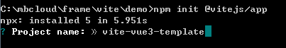
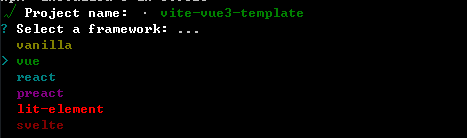
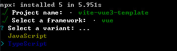
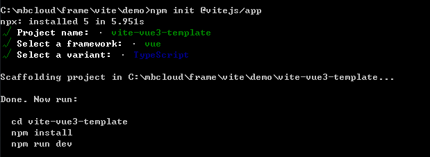
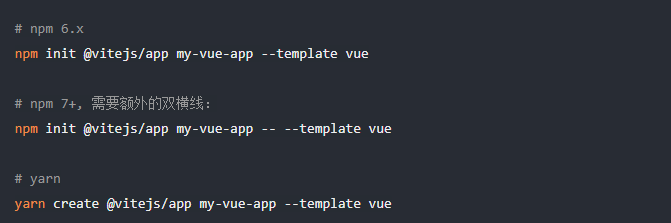
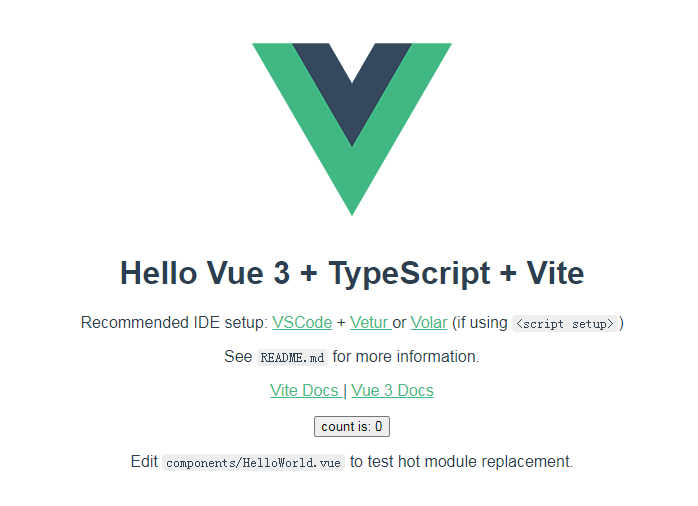
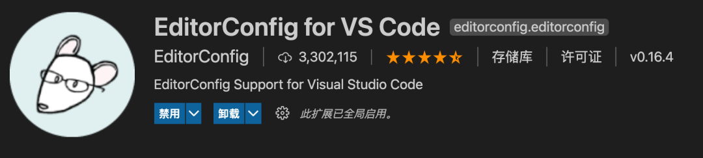

::: tip
* vite 闪电快速
* vue3 最新的vue版本
* typescript 严格的代码编写规范
:::


# 创建项目工程环境

Vue3 跟 Vite 正式版发布有很长一段时间了，生态圈也渐渐丰富起来，作者已在多个项目中使用，总结一下：就是快！也不用担心稳定性问题，开发体验真不是一般好！还没尝试的同学可以从本文开始学习，从 0 开始手把手带你搭建一套规范的 Vite + Vue3 + TypeScript 前端工程化项目环境。

本文篇幅较长，从以下几个方面展开：

  - 架构搭建
  - 代码规范
  - 提交规范
  - 单元测试
  - 自动部署

本项目完整的代码托管在 ：

https://github.com/ljp1126/vite-vue3-template

## 技术栈

  * 编程语言：`TypeScript 4.x[1]` + `JavaScript[2]`
  * 构建工具：`Vite 2.x[3]`
  * 前端框架：`Vue 3.x[4]`
  * 路由工具：`Vue Router 4.x[5]`
  * 状态管理：`Vuex 4.x[6]`
  * UI 框架：`Element Plus[7]`
  * CSS 预编译：S`tylus[8]` / `Sass[9]` / `Less[10]`
  * HTTP 工具：`Axios[11]`
  * Git Hook 工具：`husky[12]` + `lint-staged[13]`
  * 代码规范：`EditorConfig[14]` + `Prettier[15]` + `ESLint[16]` + `Airbnb JavaScript Style Guide[17]`
  * 提交规范：`Commitizen[18]` + `Commitlint[19]`
  * 单元测试：`vue-test-utils[20]` + `jest[21]` + `vue-jest[22]` + `ts-jest[23]`
  * 自动部署：`GitHub Actions[24]`

## 架构搭建

请确保你的电脑上成功安装 Node.js，本项目使用 Vite 构建工具，需要 Node.js 版本 >= 12.0.0。

查看 Node.js 版本：

``` js
  node -v
```

建议将 Node.js 升级到最新的稳定版本：

``` js
  # 使用 nvm 安装最新稳定版 Node.js
  nvm install stable
```

## 使用 Vite 快速初始化项目雏形

使用 NPM：

``` js
  npm init @vitejs/app
```

使用 Yarn：

``` js
  yarn create @vitejs/app
```

然后按照终端提示完成以下操作：

1. 输入项目名称

  例如：本项目名称 vite-vue3-starter



2. 选择模板

  本项目需要使用 Vue3 + TypeScript，所以我们选择 vue-ts，会自动安装 Vue3 和 TypeScript。

  

  选择类型

  

  生成项目

  

> 你还可以通过附加的命令行选项直接指定项目名和模板，本项目要构建 Vite + Vue3 + TypeScript 项目，则运行：



支持的模板预设包括：

  * vanilla
  * vue
  * vue-ts
  * react
  * react-ts
  * preact
  * preact-ts
  * lit-element
  * lit-element-ts
  * svelte
  * svelte-ts

3. 安装依赖

``` js
  npm install / yarn
```

4. 启动项目

``` js
  npm run dev / yarn dev
```



> 如上图，表示 Vite + Vue3 + TypeScript 简单的项目骨架搭建完毕，下面我们来为这个项目集成 Vue Router、Vuex、Element Plus、Axios、Stylus/Sass/Less。

## 修改 Vite 配置文件

Vite 配置文件 vite.config.ts 位于根目录下，项目启动时会自动读取。

本项目先做一些简单配置，例如：设置 @ 指向 src 目录、 服务启动端口、打包路径、代理等。

关于 Vite 更多配置项及用法，请查看 Vite 官网 [vitejs.dev/config/[25]](https://cn.vitejs.dev/config/) 。

``` js

import { defineConfig } from 'vite'
import vue from '@vitejs/plugin-vue'
// 如果编辑器提示 path 模块找不到，则可以安装一下 @types/node -> npm i @types/node -D
import { resolve } from 'path'

// https://vitejs.dev/config/
export default defineConfig({
  plugins: [vue()],
  resolve: {
    alias: {
      '@': resolve(__dirname, 'src') // 设置 `@` 指向 `src` 目录
    }
  },
  base: './', // 设置打包路径
  server: {
    port: 4000, // 设置服务启动端口号
    open: true, // 设置服务启动时是否自动打开浏览器
    cors: true // 允许跨域

    // 设置代理，根据我们项目实际情况配置
    // proxy: {
    //   '/api': {
    //     target: 'http://xxx.xxx.xxx.xxx:8000',
    //     changeOrigin: true,
    //     secure: false,
    //     rewrite: (path) => path.replace('/api/', '/')
    //   }
    // }
  }
})

```

## 规范目录结构

``` js
  ├── publish/
  └── src/
      ├── assets/                    // 静态资源目录
      ├── common/                    // 通用类库目录
      ├── components/                // 公共组件目录
      ├── router/                    // 路由配置目录
      ├── store/                     // 状态管理目录
      ├── style/                     // 通用 CSS 目录
      ├── utils/                     // 工具函数目录
      ├── views/                     // 页面组件目录
      ├── App.vue
      ├── main.ts
      ├── shims-vue.d.ts
  ├── tests/                         // 单元测试目录
  ├── index.html
  ├── tsconfig.json                  // TypeScript 配置文件
  ├── vite.config.ts                 // Vite 配置文件
  └── package.json
```

## 集成路由工具 Vue Router

1. 安装支持 Vue3 的路由工具 vue-router@4

``` js
npm i vue-router@4
```

2. 创建 src/router/index.ts 文件

在 src 下创建 router 目录，然后在 router 目录里新建 index.ts 文件：

``` js
└── src/ ├── router/ ├── index.ts  // 路由配置文件
```

``` ts
import {

import { createRouter, createWebHashHistory, Router, RouteRecordRaw } from 'vue-router'
import Home from '@/views/Home.vue'
import Vuex from '@/views/Vuex.vue'
import Test from '@/views/Test.vue'

const routes: Array<RouteRecordRaw> = [
  {
    path: '/',
    name: 'Home',
    component: Home
  },
  {
    path: '/vuex',
    name: 'Vuex',
    component: Vuex
  },
  {
    path: '/axios',
    name: 'Axios',
    component: () => import('@/views/Axios.vue') // 懒加载 Axios 组件
  },
  {
    path: '/test',
    name: 'Test',
    component: Test
  }
]

const router: Router = createRouter({
  history: createWebHashHistory(),
  routes
})

export default router
```

根据本项目路由配置的实际情况，你需要在 `src` 下创建 `views` 目录，用来存储页面组件。

我们在 `views` 目录下创建 `home.vue` 、`vuex.vue` 、`axios.vue`。

3. 在 main.ts 文件中挂载路由配置

``` ts
import { createApp } from 'vue'
import importUiFramework from '@/utils/import-ui-framework'
import router from '@/router/index'
import { key, store } from '@/store'
import App from './App.vue'
import '@/style/basic.styl'

const app = createApp(App)
importUiFramework(app).use(router).use(store, key).mount('#app')
```

## 集成状态管理工具 Vuex

1. 安装支持 Vue3 的状态管理工具 vuex@next

``` js
npm i vuex@next
```

2. 创建 src/store/index.ts 文件

在 src 下创建 store 目录，然后在 store 目录里新建 index.ts 文件：

``` js
  └── src/
  ├── store/
      ├── index.ts  // store 配置文件
```

``` js
  import { InjectionKey } from 'vue'
  import { createStore, Store, useStore as baseUseStore } from 'vuex'
  import RootStateTypes, { AllStateTypes } from './types'

  import numFactoryModule from './modules/NumFactory'

  export const store = createStore<RootStateTypes>({
    state: {
      text: 'This is Vuex Root.state.text'
    },
    getters: {},
    mutations: {},
    actions: {},
    modules: {
      numFactoryModule
    }
  })

  export const key: InjectionKey<Store<RootStateTypes>> = Symbol('vue-store')

  export function useStore<T = AllStateTypes>() {
    return baseUseStore<T>(key)
  }
```

3. 在 main.ts 文件中挂载 Vuex 配置

``` js
import { createApp } from 'vue'
import App from './App.vue'

import store from './store/index'

createApp(App).use(store).mount('#app')
```

## 集成 UI 框架 Element Plus

1. 安装支持 Vue3 的 UI 框架 Element Plus

``` js
npm i element-plus
```

2. 在 main.ts 文件中挂载 Element Plus

``` ts
import { createApp } from 'vue'
import App from './App.vue'

import ElementPlus from 'element-plus'
import 'element-plus/lib/theme-chalk/index.css'

createApp(App).use(ElementPlus).mount('#app')
```

## 集成 HTTP 工具 Axios

1. 安装 Axios（Axios 跟 Vue 版本没有直接关系，安装最新即可）

``` js
npm i axios
```

2. 配置 Axios

> 为了使项目的目录结构合理且规范，我们在 src 下创建 utils 目录来存储我们常用的工具函数。

Axios 作为 HTTP 工具，我们在 utils 目录下创建 axios.ts 作为 Axios 配置文件：

``` js
└── src/
├── utils/
    ├── axios.ts  // Axios 配置文件
```

``` ts
import Axios, { AxiosInstance } from 'axios'
import { ElMessage } from 'element-plus'

const baseURL = 'https://api.github.com'

const axios: AxiosInstance = Axios.create({
  baseURL,
  timeout: 20000 // 请求超时 20s
})

// 前置拦截器（发起请求之前的拦截）
axios.interceptors.request.use(
  (config) => {
    /**
     * 根据你的项目实际情况来对 config 做处理
     * 这里对 config 不做任何处理，直接返回
     */
    return config
  },
  (error) => {
    return Promise.reject(error)
  }
)

// 后置拦截器（获取到响应时的拦截）
axios.interceptors.response.use(
  (response) => {
    /**
     * 根据你的项目实际情况来对 response 和 error 做处理
     * 这里对 response 和 error 不做任何处理，直接返回
     */
    return response
  },
  (error) => {
    if (error.response && error.response.data) {
      const code = error.response.status
      const msg = error.response.data.message
      ElMessage.error(`Code: ${code}, Message: ${msg}`)
      console.error(`[Axios Error]`, error.response)
    } else {
      ElMessage.error(`${error}`)
    }
    return Promise.reject(error)
  }
)

export default axios
```

3. 使用 Axios

在需要使用 Axios 文件里，引入 Axios 配置文件，参考如下：

``` vue
<template></template>
<script lang="ts">
import { defineComponent } from 'vue' 
import axios from '../utils/axios'

export default defineComponent({ 
  setup() { 
    axios .get('/users/XPoet') .then((res) => { 
      console.log('res: ', res) 
    }) .catch((err) => { 
      console.log('err: ', err) 
    }) 
  } 
}) 
</script>
```

## 集成 CSS 预编译器 Stylus/Sass/Less

本项目使用 CSS 预编译器 Stylus，直接安装为开发依赖即可。Vite 内部已帮我们集成了相关的 loader，不需要额外配置。同理，你也可以使用 Sass 或 Less 等。

1. 安装

``` js
  npm i stylus -D
  # or
  npm i sass -D
  npm i less -D
```

2. 使用

``` js
使用
```

至此，一个基于 TypeScript + Vite + Vue3 + Vue Router + Vuex + Element Plus + Axios + Stylus/Sass/Less 的前端项目开发环境搭建完毕。

下面我们来打磨这个项目，增加代码规范约束、提交规范约束、单元测试、自动部署等，让其更完善、更健壮。

## 代码规范

随着前端应用逐渐变得大型化和复杂化，在同一个项目中有多个人员参与时，每个人的前端能力程度不等，他们往往会用不同的编码风格和习惯在项目中写代码，长此下去，势必会让项目的健壮性越来越差。解决这些问题，理论上讲，口头约定和代码审查都可以，但是这种方式无法实时反馈，而且沟通成本过高，不够灵活，更关键的是无法把控。不以规矩，不能成方圆，我们不得不在项目使用一些工具来约束代码规范。

本文讲解如何使用 EditorConfig + Prettier + ESLint 组合来实现代码规范化。

这样做带来好处：

解决团队之间代码不规范导致的可读性差和可维护性差的问题。
解决团队成员不同编辑器导致的编码规范不统一问题。
提前发现代码风格问题，给出对应规范提示，及时修复。
减少代码审查过程中反反复复的修改过程，节约时间。
自动格式化，统一编码风格，从此和脏乱差的代码说再见。

## 集成 EditorConfig 配置

EditorConfig 有助于为不同 IDE 编辑器上处理同一项目的多个开发人员维护一致的编码风格。

官网：[editorconfig.org'[26]'](https://editorconfig.org/)

在项目根目录下增加 .editorconfig 文件：

``` js
  # Editor configuration, see http://editorconfig.org

  # 表示是最顶层的 EditorConfig 配置文件
  root = true

  [*] # 表示所有文件适用
  charset = utf-8 # 设置文件字符集为 utf-8
  indent_style = space # 缩进风格（tab | space）
  indent_size = 2 # 缩进大小
  end_of_line = lf # 控制换行类型(lf | cr | crlf)
  trim_trailing_whitespace = true # 去除行首的任意空白字符
  insert_final_newline = true # 始终在文件末尾插入一个新行

  [*.md] # 表示仅 md 文件适用以下规则
  max_line_length = off
  trim_trailing_whitespace = false
```

注意：

  * VSCode 使用 EditorConfig 需要去插件市场下载插件 EditorConfig for VS Code 。

  

  * JetBrains 系列（WebStorm、IntelliJ IDEA 等）则不用额外安装插件，可直接使用 EditorConfig 配置。

## 集成 Prettier 配置

Prettier 是一款强大的代码格式化工具，支持 JavaScript、TypeScript、CSS、SCSS、Less、JSX、Angular、Vue、GraphQL、JSON、Markdown 等语言，基本上前端能用到的文件格式它都可以搞定，是当下最流行的代码格式化工具。

官网：[prettier.io/[27]](https://prettier.io/)

1. 安装 Prettier

``` js
npm i prettier -D
```

2. 创建 Prettier 配置文件

  Prettier 支持多种格式的配置文件[28]，比如 .json、.yml、.yaml、.js等。

  在本项目根目录下创建 .prettierrc 文件。

3. 配置 .prettierrc

``` js
{
  "useTabs": false,
  "tabWidth": 2,
  "printWidth": 88,
  "singleQuote": true,
  "trailingComma": "none",
  "bracketSpacing": true,
  "semi": false
}
```

4. Prettier 安装且配置好之后，就能使用命令来格式化代码

``` js
# 格式化所有文件（. 表示所有文件）
npx prettier --write .
```

注意：

  * VSCode 编辑器使用 Prettier 配置需要下载插件 `Prettier - Code formatter` 。

  * JetBrains 系列编辑器（WebStorm、IntelliJ IDEA 等）则不用额外安装插件，可直接使用 Prettier 配置。

Prettier 配置好以后，在使用 VSCode 或 WebStorm 等编辑器的格式化功能时，编辑器就会按照 Prettier 配置文件的规则来进行格式化，避免了因为大家编辑器配置不一样而导致格式化后的代码风格不统一的问题。

## 集成 ESLint 配置

`ESLint[30] `是一款用于查找并报告代码中问题的工具，并且支持部分问题自动修复。其核心是通过对代码解析得到的 AST（Abstract Syntax Tree 抽象语法树）进行模式匹配，来分析代码达到检查代码质量和风格问题的能力。

正如前面我们提到的因团队成员之间编程能力和编码习惯不同所造成的代码质量问题，我们使用 ESLint 来解决，一边写代码一边查找问题，如果发现错误，就给出规则提示，并且自动修复，长期下去，可以促使团队成员往同一种编码风格靠拢。

1. 安装 ESLint

可以全局或者本地安装，作者推荐本地安装（只在当前项目中安装）。

``` js
npm i eslint -D
```

2. 配置 ESLint

ESLint 安装成功后，执行 npx eslint --init，然后按照终端操作提示完成一系列设置来创建配置文件。