> 性能优化
<!-- more -->

## 前言

前端页面性能是影响用户体验的关键因素，用户打开网站时间太久、白屏时间过长、操作卡顿等，都会导致用户离开页面，严重影响用户的留存率。Google DoubleClick 研究表明：如果一个移动端页面加载时长超过 3 秒，用户就会放弃而离开。BBC 发现网页加载时长每增加 1 秒，用户就会流失 10%。

那么，如何去计算页面的性能，以便于更好地衡量和改进前端页面性能，这就需要前端性能指标，本文简单介绍每一种性能指标的定义，旨在帮助你理解性能指标，具体优化及详细解读将在后面章节中介绍

## 性能指标

以下分为三个过程来看性能指标：

  1. 文档加载过程
  2. 文档渲染呈现过程
  3. 交互过程

### 文档加载过程

下图是 W3C 的 Navigation Timing 的处理模型，从当前浏览器窗口卸载旧页面开始，到新页面加载完成，整个过程一共被切分为 9 个小块：

  1. 提示卸载旧文档
  2. 重定向/卸载
  3. 应用缓存
  4. DNS 解析
  5. TCP 握手
  6. HTTP 请求处理
  7. TTP 响应处理
  8. DOM 处理
  9. 文档装载完成

每个小块，取 Unix 时间戳，两两事件之间计算时间差，从而获取中间过程的耗时（精确到毫秒级别）。

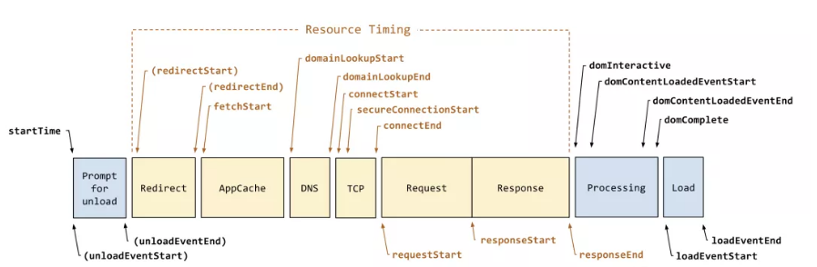

解读

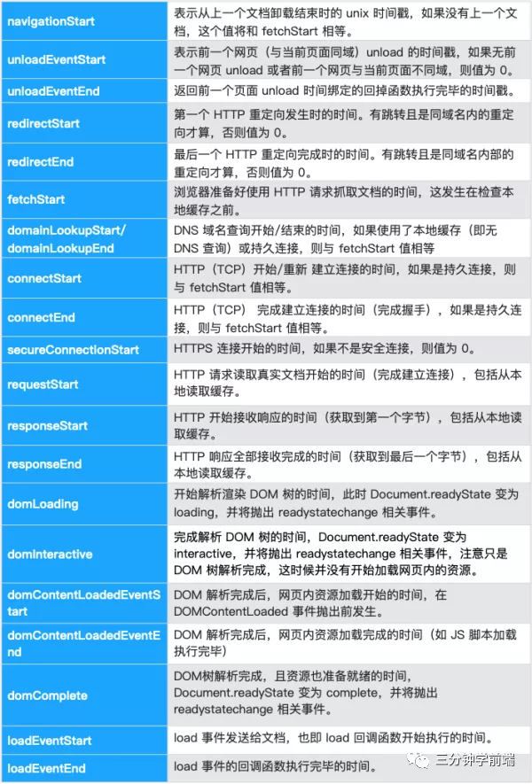

文档加载过程主要包含以下 几个性能指标：

### TTFB

Time to First Byte，是发出页面请求到接收到应答数据第一个字节所花费的毫秒数，这个时间段内包括 DNS 查找、TCP 连接和 SSL 连接

TTFB 不仅仅是在服务器上花费的时间，还包括设备请求发送到服务器，再从服务器返回到设备的时间，它计算的是整个延迟的往返时间。

### DCL

DOMContentLoaded，下图更直观的表示下

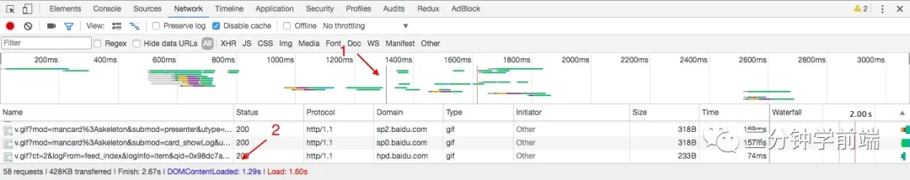

什么是 DOMContentLoaded？

首先我们先思考一下，如何衡量网页的加载性能？有人认为可以通过计算从空白到完全加载的过程，但其实有些图片等可能加载较慢，但不影响整个页面的正常使用，所以，我们仅仅需要在空白网页看到内容即可

所以，我们也可以通过计算这个网页从空白到出现内容所花费的时间，来衡量网页文档的加载性能，那么该如何计算这段时间喃？DOMContentLoaded 就是，当初始的 HTML 文档被完全加载和解析完成之后，DOMContentLoaded 事件被触发，而无需等待样式表、图像和子框架的完全加载

### L

Load，onLoad 事件触发所需时间，仅在页面所有资源都加载完毕后（比如图片，CSS），onLoad 事件才被触发

## 文档渲染呈现过程

### FP&FCP

FP（First Paint）：首次绘制，这个指标用于记录页面第一次绘制像素的时间
FCP（First Contentful Paint）：首次内容绘制，这个指标用于记录页面首次绘制文本、图片、非空白 Canvas 或 SVG 的时间，也包括带有正在加载中的 Web 字体的文本
这两个指标看起来大同小异，但是 FP 发生的时间一定大于等于 FCP，如下图是掘金的指标：

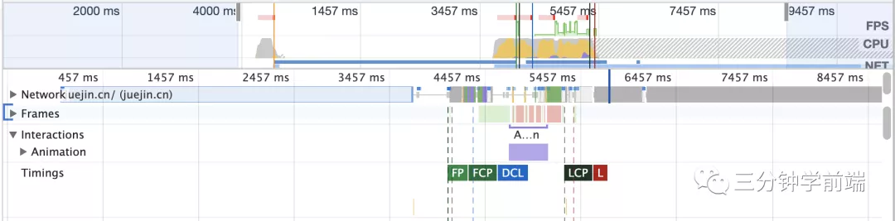

FP 指的是绘制像素，比如说页面的背景色是灰色的，那么在显示灰色背景时就记录下了 FP 指标

但是此时 DOM 内容还没开始绘制，可能需要文件下载、解析等过程，只有当 DOM 内容发生变化才会触发，比如说渲染出了一段文字，此时就会记录下 FCP 指标

我们可以把这两个指标认为是和白屏时间相关的指标

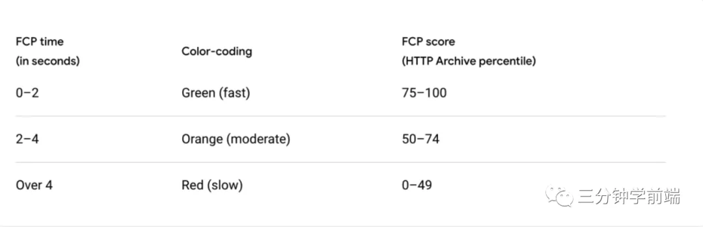

### FMP

First Meaningful Paint，是指页面的首要内容出现在屏幕上的时间，对于不同的站点，首要内容是不同的，例如：

博客文章：【大标题 + 首屏文字】是首要内容；
百度或 Google 的搜索结果页：【首屏的结果】就是首要内容；
淘宝等购物网站：【图片】会极为重要，因此它是首要内容；
在 Lighthouse 6.0 中已不推荐使用 FMP，建议使用 LCP 代替.

### LCP

Largest Contentful Paint，最大内容绘制，用于记录视窗内最大的元素绘制的时间，该时间会随着页面渲染变化而变化，因为页面中的最大元素在渲染过程中可能会发生改变，另外该指标会在用户第一次交互后停止记录。指标变化如下图：

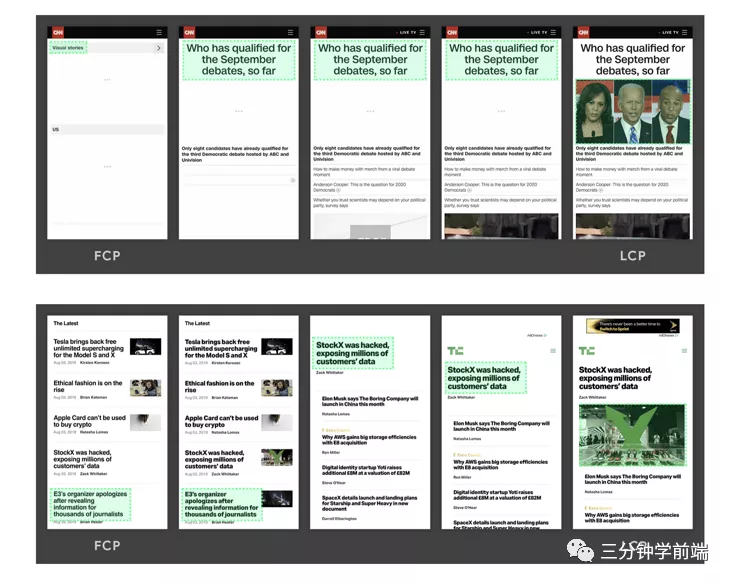

LCP 其实能比 FP、FCP、FMP 更能体现一个页面的性能好坏程度，因为这个指标会持续更新。举个例子：当页面出现骨架屏或者 Loading 动画时 FCP 其实已经被记录下来了，但此时页面内容其实并未呈现

在 2.5 秒内表示体验优秀

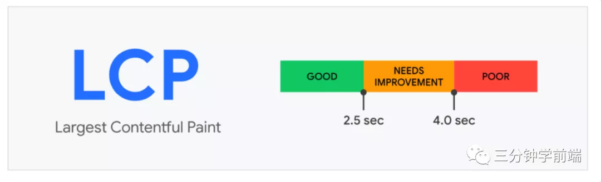

LCP 目前并不会计算所有元素，因为这样会使这个指标变得非常复杂，它现在只关注下面的元素：

  1. `` 元素
  2. `<image>`元素内的`<svg>`元素
  3. `<video>` 元素
  4. 通过 url() 函数加载背景图片的元素
  5. 包含文本节点或其他内联文本元素子级的块级元素。

### SI

Speed Index，用于度量页面加载过程中内容可视化显示的速度，是 Lighthouse 的六个度量标准之一

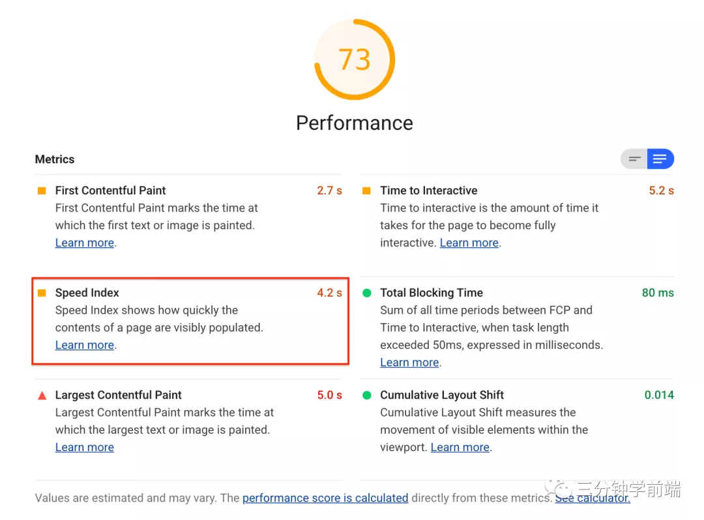

具体如何测量喃？首先在浏览器中捕获页面加载的视频，然后对每 100 毫秒间隔的页面截图计算页面填充的百分比，可以得到这样一个曲线（纵轴是页面可视区域内容填充完成度，横轴是时间）

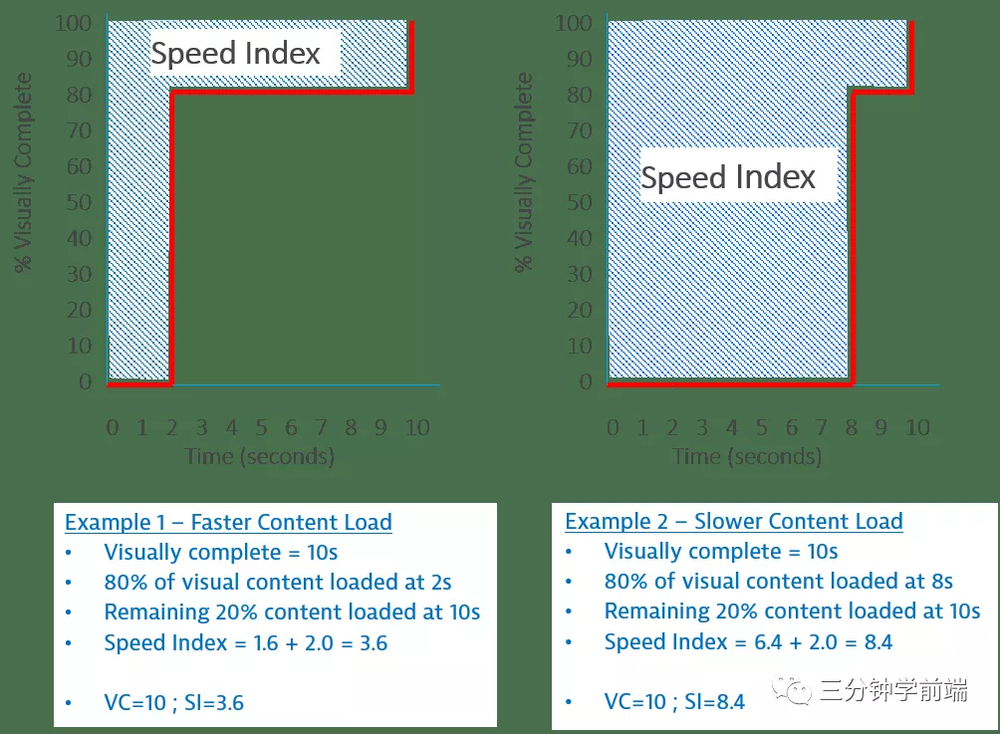

上图中的两个都是在 10s 时页面填充完成，但Example 1（左图）在 2s 是就已经填充了 80% 的内容，而 Example 2（右图）在 8s 时才填充 80%

``` html
计算 SI ：

Example 1：Speed Index = (80% * 2) + （20% * 10）= 3.6

Example 2：Speed Index = (80% * 8) + （20% * 10）= 8.4
```

其中，SI：0-3.4 为最优

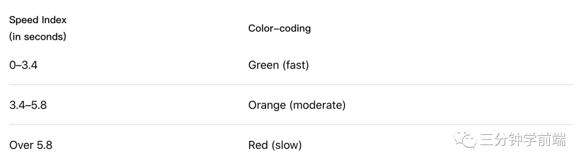

### FSP

First Screen Paint，即页面从开始加载到首屏内容全部绘制完成的时间，用户可以看到首屏的全部内容

## 交互过程

### TTI

Time to Interactive，用于表示网页首次完全达到可交互状态的时间点

完全达到可交互状态的时间点是从 FCP 开始，在最后一个长任务（Long Task）完成的时间，并且在随后的 5 秒内网络和主线程是空闲的，如下图：


Google 提出了一个 RAIL 模型：对于用户交互（比如点击事件），推荐的响应时间是 100ms 以内。那么为了达成这个目标，推荐在空闲时间里执行任务不超过 50ms（W3C 也有这样的标准规定），这样能在用户无感知的情况下响应用户的交互，否则就会造成延迟感

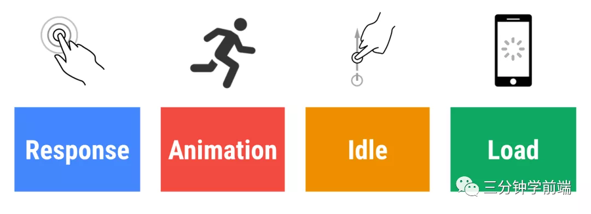

这是一个很重要的用户体验指标，代表着页面何时真正进入可用的状态。毕竟光内容渲染的快也不够，还要能迅速响应用户的交互。想必大家应该体验过某些网站，虽然内容渲染出来了，但是响应交互很卡顿，只能过一会才能流畅交互的情况。

### FCI

First CPU Idle，页面首可交互时间

与 TTI 不同的是：FCI 发生在用户可以开始与页面交互时；TTI 发生在用户完全能够（可持续）与页面交互时

## FID

First Input Delay，首次输入延迟，用于记录在 FCP 和 TTI 之间用户首次与页面交互时响应的延迟

就是看用户交互事件触发到页面响应中间耗时多少，如果其中有长任务发生的话那么势必会造成响应时间变长

### FPS

Frames Per Second，用于表示每秒可以重新绘制的帧数，是衡量应用流畅度的一个非常重要的指标，60fps（每次绘制 16.7ms） 是页面流畅的目标，否则用户便会感觉到页面卡顿


## 核心性能指标

以上我们学习了 13 个性能指标，但最常用、最关键的是以下四个核心指标：

1. 白屏时间：页面空白时间，FP&FCP
2. 首屏时间：页面可视区域内容以完全呈现时间，FSP
3. 可交互时间：用户首次可交互时间，FCI
4. 可持续交互时间：用户首次可完全可持续交互时间，TTI

## 总结与思考

本文，我们学习了从文档加载到用户交互所涉及的性能指标：

  * 文档加载过程：

    * TTFB：从请求开始到接收第一字节的时间
    * DCL：空白到出现内容所花费的时间
    * L：onLoad 事件触发所需时间

  * 渲染呈现过程：

    * FP&FCP：首次绘制（FP，可能是背景色或loading），首次内容绘制时间（FCP）
    * FMP：首要内容出现在屏幕上的时间
    * LCP：视窗内最大的元素绘制的时
    * SI：页面加载过程中内容可视化显示的速度
    * FSP：从开始加载到首屏内容全部绘制完成的时间

  * 交互过程：

    * TTI：网页首次完全达到可交互状态的时间点
    * FCI：页面首可交互时间
    * FID：首次输入延迟
    * FPS：每秒可以重新绘制的帧数，用于衡量应用流畅度

其中最重要的是白屏时间（FP&FCP）、首屏时间（FSP）、可交互时间（FCI）、可持续交互时间（TTI），下一章，我们将走进新一代性能指标 Web Vitals


## 参考链接

 * MDN
 * Web 性能指标：https://juejin.cn/post/6844904153869713416
